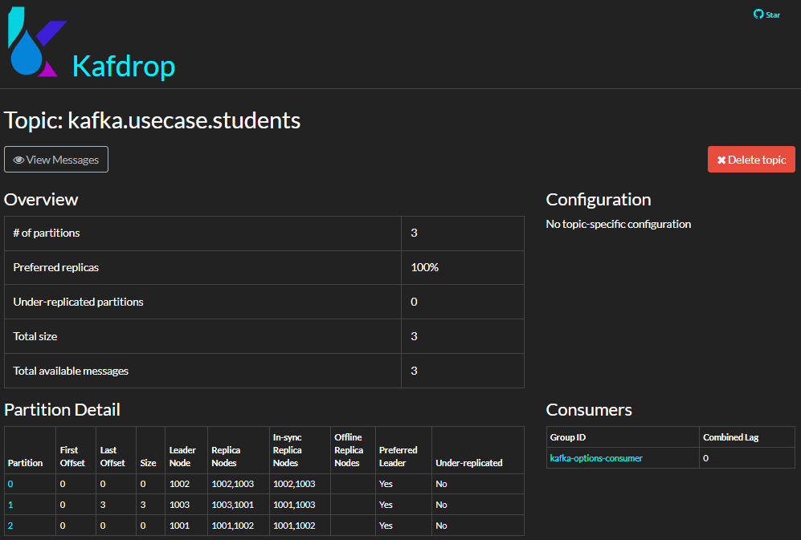

1. Create a topic "kafka.usecase.students" with kafdrop
- Partitions: 3
- Replication Factor: 2

2. Create a Python Producer for the topic
- Batch size: 32KB
- acks: all
- Publish async with callback

[producer.py](python-kafka/usecase_exercise/producer.py)

3. Create a Python Consumer for the topic
- Fetch.min.bytes*: 20
- Fetch.max.wait.ms: 200
- Async commit

\* Video says Fetch.max.bytes, but `fetch.max.bytes` must be less than `message.max.bytes` which has a minimum of `1000`.

[consumer.py](python-kafka/usecase_exercise/consumer.py)